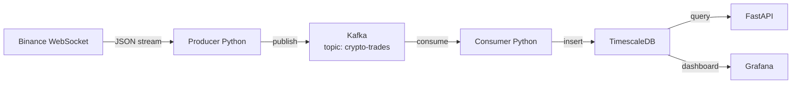

# pipeline-streaming-crypto


Pipeline d'ingestion et d'exposition de données crypto en temps réel à partir de Binance WebSocket.

## Aperçu

Ce projet implémente un pipeline de données temps réel qui capture les flux de marché Binance,
les transporte via Kafka, les stocke dans TimescaleDB et les expose via une API REST.

Construit dans le cadre d'une montée en compétence en data engineering, il couvre les briques
principales d'un pipeline orienté streaming : ingestion, transport, stockage, exposition et visualisation.

## Architecture



## Stack technique

| Couche        | Technologie          | Rôle                         |
|---------------|----------------------|------------------------------|
| Source        | Binance WebSocket    | Flux de marché en temps réel |
| Ingestion     | Python / websockets  | Producteur Kafka             |
| Transport     | Apache Kafka         | Transit de flux découplé     |
| Stockage      | TimescaleDB          | Séries temporelles SQL       |
| Exposition    | FastAPI              | API REST                     |
| Visualisation | Grafana              | Dashboard temps réel         |
| Infra         | Docker Compose       | Environnement portable       |

## Statut des phases

| Phase | Contenu                                      | Statut     |
|-------|----------------------------------------------|------------|
| 1     | Binance WebSocket → console                  | ⬜ à faire |
| 2     | Kafka local + Producer                       | ⬜ à faire |
| 3     | Consumer + TimescaleDB                       | ⬜ à faire |
| 4     | FastAPI                                      | ⬜ à faire |
| 5     | Docker Compose + Grafana + documentation     | ⬜ à faire |

## Lancement rapide

```bash
git clone https://github.com/Kepsilone/pipeline-streaming-crypto
cd pipeline-streaming-crypto
cp .env.example .env
docker compose up -d
python src/producer.py
```

## Structure du repo

```
pipeline-streaming-crypto/
├── src/
│   ├── producer.py
│   └── consumer.py
├── docs/
├── tests/
├── .env.example
├── docker-compose.yml
└── README.md
```

## Auteur

Sabeur JEDID — Ingénieur simulations numériques orienté data engineering.  
Portfolio : [kepsilone.com](https://kepsilone.com) · GitHub : [github.com/Kepsilone](https://github.com/Kepsilone)
